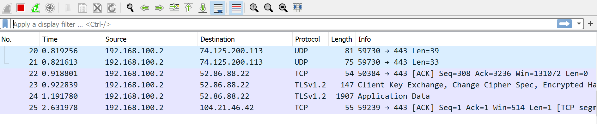
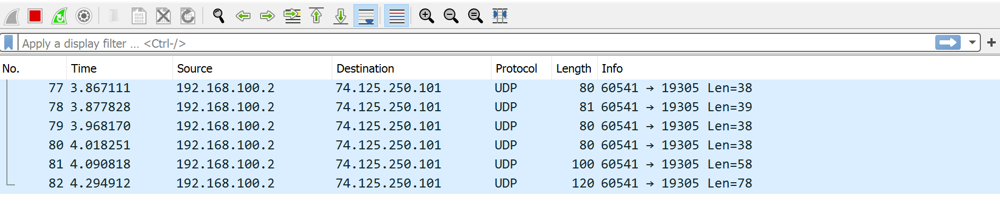

# Laporan Resmi Praktikum Jarkom Modul 1
### Anggota kelompok:
Anggota | NRP | 
------------- | ------------- | 
Amanda Rozi Kurnia | 05111940000094 | 
Dyandra Paramitha W. | 05111940000119 |
Daanii Nabil Ghinannafsi Kusnanta | 05111940000163 |

## Daftar Soal
[Drive Praktikum Modul 1](https://drive.google.com/drive/folders/11lLVpFeBZ3XNx3Oc4k8BPutYxMgWtWq4?usp=sharing)
* [Soal 1](#soal1)
* [Soal 2](#soal2)
* [Soal 3](#soal3)
* [Soal 4](#soal4)
* [Soal 5](#soal5)
* [Soal 6](#soal6)
* [Soal 7](#soal7)
* [Soal 8](#soal8)
* [Soal 9](#soal9)
* [Soal 10](#soal10)
* [Soal 11](#soal11)
* [Soal 12](#soal12)
* [Soal 13](#soal13)
* [Soal 14](#soal14)
* [Soal 15](#soal15)

## <a name="soal1"></a> Soal 1
### Sebutkan webserver yang digunakan pada "ichimarumaru.tech"! 

Display filter yang digunakan adalah: <br>
```
http.host eq “ichimarumaru.tech” 
```
Setelah memasukkan display filter dan melakukan _search_, akan muncul paket yang sesuai yaitu dimana _host_ berasal dari `ichimarumaru.tech`

<br>

Pilih paket pertama, klik kanan kemudian **Follow > HTTP Stream.** Akan muncul sebuah panel baru yang berisi informasi tentang website tersebut. Terlihat bahwa web server yang digunakan adalah __nginx/1.18.0 (Ubuntu)__


## <a name="soal2"></a> Soal 2
### Temukan paket dari web-web yang menggunakan basic authentication method!

Untuk menemukan paket dari web yang menggunakan basic authentication method adalah sebagai berikut. Display filter: <br>
```
http.authbasic
```

Adapun setelah memasukkan _display filter_ maka akan muncul paket-paket yaitu: 

<image src="images/no2a.png" alt="nomor 2a" width="700">

## <a name="soal3"></a> Soal 3
### Ikuti perintah di [basic.ichimarumaru.tech](http://basic.ichimarumaru.tech/)! Username dan password bisa didapatkan dari file .pcapng!
Display filter:
```
  http.host == basic.ichimarumaru.tech
```
Kemudian, find string in packet details "Credentials". Pada bagian Authorization, akan ditemukan Credentials yang merupakan username dan password yang dicari. <br>
  
<image src="images/no3a.png" alt="nomor 3a" width="700"><br>
  
**Username:** kuncimenujulautan <br>
**Password:** tQKEJFbgNGC1NCZlWAOjhyCOm6o3xEbPkJhTciZN
  
## <a name="soal4"></a> Soal 4
### Temukan paket mysql yang mengandung perintah query select!
Untuk menemukan paket mysql dapat menggunakan _display filter_ `mysql`. Dan untuk menemukan paket yang mengandung query select dapat dilakukan dengan filter `contains select`. Sehingga untuk menjawab soal, digunakan display filter `mysql contains select`.
 <image src="images/no4a.png" alt="nomor 4a" width="700"><br>
Maka didapat 2 paket yang mengandung query select. Salah satunya mengandung query `select count(*) from users`.
  
## <a name="soal5"></a> Soal 5
### Login ke [portal.ichimarumaru.tech](http://portal.ichimarumaru.tech/) kemudian ikuti perintahnya! Username dan password bisa didapat dari query insert pada table users dari file .pcap! 
Pertama-tama kita harus mendapatkan username dan password sebelum menuju portal. Untuk menemukannya dapat dicari pada file hasil capture `1-5.pcap`. Lalu, gunakan display filter `mysql` untuk mendapatkan paket-paket mysql. Karena menurut informasi soal, username dan password terdapat dari query insert pada mysql. 
   <image src="images/no5a.png" alt="nomor 5a" width="700"><br>
 Setelah itu periksa isi-isi paket tersebut. Klik kanan pada salah satu paket lalu klik Follow > TCP Stream. maka akan didapat isi dari percakapan paket paket mysql tersebut.
     <image src="images/no5b.png" alt="nomor 5b" width="700"><br>
 Dapat dilihat pada salah satu paket atau percakapan terdapat query `INSERT INTO users (username,password) VALUES ("akakanomi",md5("pemisah4lautan"))`. Sehingga didapatkan username akakanomi dan password pemisah4lautan. Setelah itu kita bisa langsung masuk ke [portal.ichimarumaru.tech](http://portal.ichimarumaru.tech/)/. Setelah login akan muncul tampilan berikut. Tampilan berisi soal tentang urutan konfigurasi pengkabelan T568B. Jawaban diisikan pada web lalu di Screenshot. 
     <image src="images/no5c.png" alt="nomor 5c" width="700"><br>  
Urutan konfigurasi pengkabelan T568B adalah oranye-putih, oranye, hijau-putih, biru, biru-putih, hijau, cokelat-putih, cokelat.     
     
## <a name="soal6"></a> Soal 6
### Cari username dan password ketika melakukan login ke FTP Server!
FTP menggunakan command "USER" ketika ingin memasukkan username dan "PASS" ketika ingin memasukkan password. Display filter:
```
  ftp.request.command == USER || ftp.request.command == PASS
```
<image src="images/no6a.png" alt="nomor 6a" width="700"><br>
  
## <a name="soal7"></a> Soal 7
### Ada 500 file zip yang disimpan ke FTP Server dengan nama 0.zip, 1.zip, 2.zip, ..., 499.zip. Simpan dan Buka file pdf tersebut. (Hint = nama pdf-nya `Real.pdf`)

Display filter yang digunakan adalah: <br>
```
  ftp-data contains Real.pdf
```

Kemudian akan muncul paket-paket berikut: <br>


Pilih paket pertama, kemudian **Follow > TCP Stream > Ubah ASCII menjadi RAW > Save As Real.pdf**

Adapun isi dari file tersebut adalah: <br>


## <a name="soal8"></a> Soal 8
### Cari paket yang menunjukan pengambilan file dari FTP tersebut!
Display filter yang digunakan adalah: <br>
```
  ftp.request.command == RETR
```

Kemudian setelah kita melakukan pencarian menggunakan *display filter*, kita dapat melihat paket-paket yang berkaitan. 


## <a name="soal9"></a> Soal 9
### Dari paket-paket yang menuju FTP terdapat indikasi penyimpanan beberapa file. Salah satunya adalah sebuah file berisi data rahasia dengan nama `secret.zip`. Simpan dan buka file tersebut!

Display filter:
```
  ftp-data
```

Find string in packet list `secret.zip`. Kemudian, klik kanan dan pilih `Follow > TCP Stream > Ganti format file menjadi Raw > Save as secret.zip`
  
 <br>

Kemudian, buka file `secret.zip` yang telah disimpan. Akan muncul perintah untuk memasukkan password.
  
 <br>


## <a name="soal10"></a> Soal 10
### Selain itu terdapat `history.txt` yang kemungkinan berisi history bash server tersebut! Gunakan isi dari `history.txt` untuk menemukan password untuk membuka file rahasia yang ada di `secret.zip`!

Display filter:
```
  ftp-data
```

Find string in packet list `history.txt`
  
 <br>

Kemudian, klik kanan dan pilih `Follow > TCP Stream`. Ada petunjuk baru, yaitu `bukanapaapa.txt`.
  
 <br>

Ulangi langkah sebelumnya, input display filter: `ftp-data` <br>
Find string in packet list `bukanapaapa.txt`

 <br>

Kemudian, klik kanan dan pilih `Follow > TCP Stream`. Kita akan menemukan petunjuk password berupa `dibilangbukanapaapajugagapercaya`

 <br>

Gunakan password tersebut untuk membuka file `Wanted.pdf`.

 <br>

## <a name="soal11"></a> Soal 11
### Mengambil paket yang berasal dari port 80

Capture Filter:
```
src port 80
```
  
 <br>
  
Hasil Capture Filter: <br>
  
 <br>
  
## <a name="soal12"></a> Soal 12
###  Mengambil paket yang mengandung port 21

Capture Filter:
```
port 21
```
  
 <br>
  
Hasil Capture Filter: <br>
  
 <br>

## <a name="soal13"></a> Soal 13
### Menampilkan paket yang menuju port 443

Capture Filter:
```
dst port 443
```
  
 <br>
  
Hasil Capture Filter: <br>
  
 <br>
  
## <a name="soal14"></a> Soal 14
### Mengambil paket yang tujuannya [kemenag.go.id](https://kemenag.go.id/)

Capture Filter:
```
dst host kemenag.go.id atau dst host 103.7.13.247
```
  
 <br>
  
Hasil Capture Filter: <br>
  
 <br>

  ## <a name="soal15"></a> Soal 15
### Mengambil paket yang berasal dari ip kalian
Untuk mendapatkan ip pribadi: Open cmd ketik ```ipconfig``` <br>
ip pada jaringan Wireless LAN adapter Wi-Fi adalah <b>192.168.100.2</b>
  
 <br>

Capture Filter untuk mengambil paket yang berasal dari ip pribadi: 
```
src host 192.168.100.2
```

 <br>
  
Hasil Capture Filter: <br>
  
 <br>
